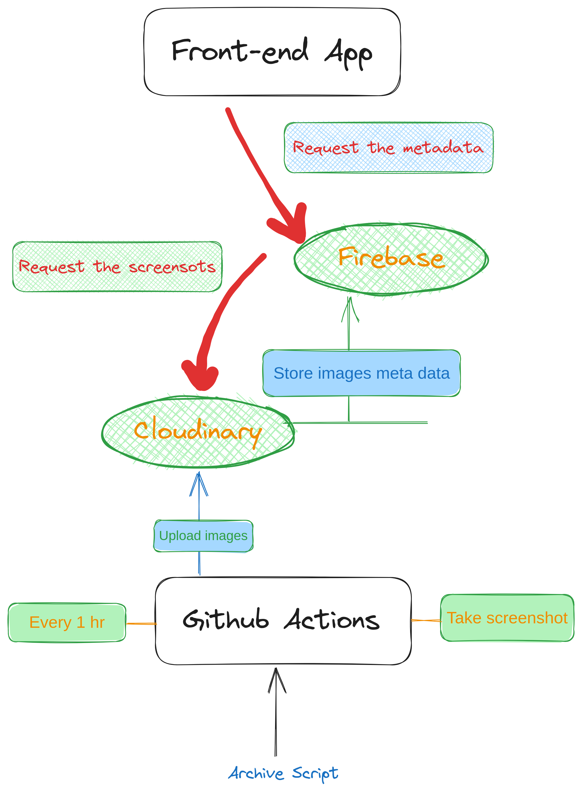

Image archive of the news website - the app is taking a full screenshot from Polish news website every hour and archiving in cloudinary and saving the meta data of each picture to Firebase

## Tech Stacks
- Next.js
- React
- Tailwindcss
- TypeScript
- Firebase
- Cloudinary
- Github Actions

